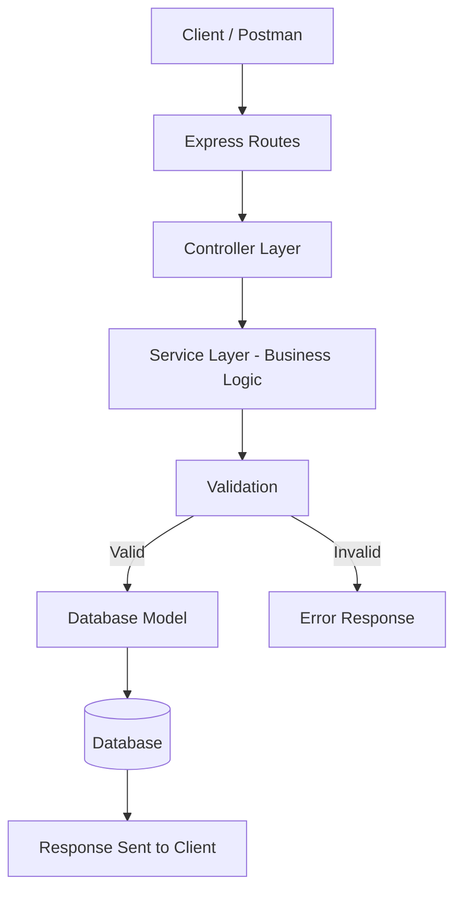
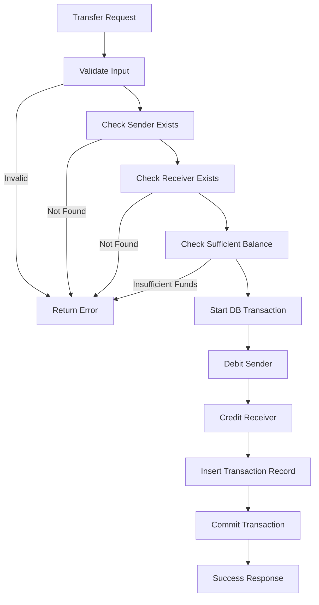
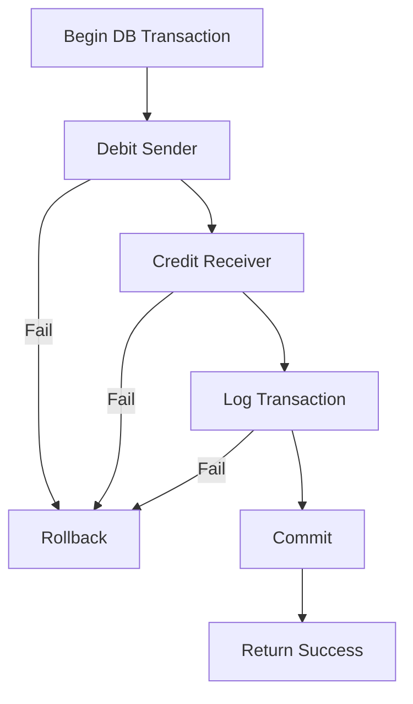

# 💳 Bank Transaction System Backend

A production-style Banking Transaction Backend System built using Node.js and Express.js.

---

## 🧠 Overview

This project simulates real-world banking operations:

- Account creation
- Deposits
- Withdrawals
- Inter-account transfers
- Transaction logging

---

## 🔄 System Architecture Flow




## 💳 Money Transfer Processing Flow




## 🔁 Transaction Rollback Safety :



---

## 🧾 Features

- Account Management
- Deposit & Withdrawal
- Safe Money Transfer
- Transaction History
- Input Validation
- Error Handling Middleware
- Modular Architecture
- Database Transaction Support
---

## 📦Tech Stack :

- Node.js
- Express.js
- MongoDB 
- Mongoose 
- Postman (Testing)

---

📌API Endpoints :

| Method | Endpoint            | Description      |
| ------ | ------------------- | ---------------- |
| POST   | `/api/accounts`     | Create Account   |
| GET    | `/api/accounts`     | Get All Accounts |
| GET    | `/api/accounts/:id` | Get Account      |

💰 Transactions :

| Method | Endpoint                     | Description         |
| ------ | ---------------------------- | ------------------- |
| POST   | `/api/transactions/deposit`  | Deposit Money       |
| POST   | `/api/transactions/withdraw` | Withdraw Money      |
| POST   | `/api/transactions/transfer` | Transfer Money      |
| GET    | `/api/transactions`          | Transaction History |

--- 

## 📁 Project Structure

```bash
src/
├── routes/
├── controllers/
├── services/
├── models/
├── middlewares/
├── config/
└── app.js
```
---

## ⚙ Installation :

- git clone https://github.com/Harsh14-prog/Backend-Ledger.git
- cd Backend-Ledger
- npm install

--- 

## Create .env file: 

- MONGODB_URI=your_mongodb_connection_string
- JWT_SECRET=your_jwt_secret
- CLIENT_ID=your_google_client_id
- CLIENT_SECRET=your_google_client_secret
- REFRESH_TOKEN=your_refresh_token
- EMAIL_USER=your_email

--- 

## Run:
npm run dev
